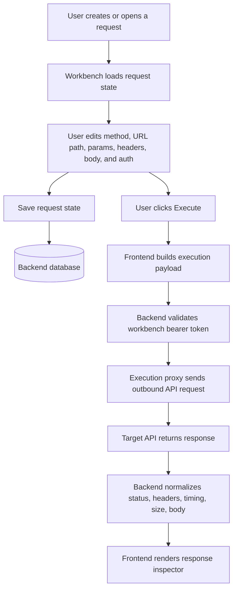
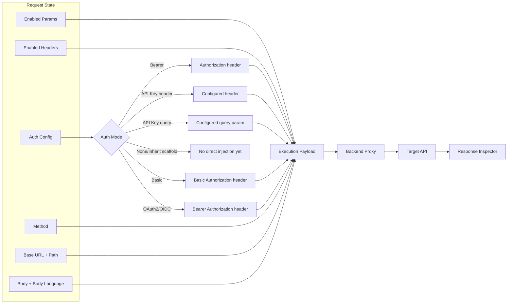

# Vue API Workbench

Vue API Workbench is a Nuxt and Go API workbench for creating collections, configuring request data, proxying execution through the backend, and inspecting responses.

## Repository

- `frontend/`: Nuxt 4 application.
- `backend/`: Go API, auth, storage, migrations, and request execution proxy.
- `.tmp/`: local tool/cache output, ignored by git.

## Request Lifecycle



## Execution Translation



## Local Commands

```bash
task frontend:dev
task backend:dev
task db:plan
task db:migrate
```

The latest generated migration must be applied locally before persisted request editor fields are available in an existing database.
